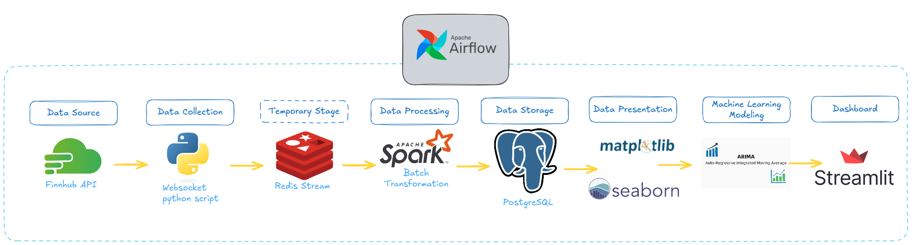

# 📈 Nvidia Stock Forecasting
This project is an end-to-end **data engineering pipeline** designed to collect real-time stock price data for Nvidia via WebSocket from the Finnhub API. The collected data is temporarily streamed into Redis-Stream and held there until the U.S. stock market closes.

At the end of the trading day, the system performs **batch processing** using Apache Spark to aggregate and transform the raw tick data into structured hourly time-series format. The transformed data is stored in PostgreSQL for further analysis, visualization (with Matplotlib and Seaborn), and forecasting using an ARIMA model. The pipeline is orchestrated with Apache Airflow and the insights are presented via an interactive Streamlit dashboard.

## 🧰 Tools

In developing this project, we used the following tools:

| No. | Tool                  | Function                                                                 |
|-----|-----------------------|--------------------------------------------------------------------------|
| 1.  | **Python 3.12**       | Main programming language for all components. |
| 2.  | **Finnhub API**       | Provides real-time Nvidia stock price data via WebSocket.               |
| 3.  | **Redis Stream**      | Acts as a message broker to temporarily store and stream incoming stock data. |
| 4.  | **Apache Spark**      | Performs batch data processing and feature engineering (e.g., OHLCV aggregation). |
| 5.  | **Apache Airflow**    | Orchestrates daily ETL jobs and schedules batch processing pipelines.  |
| 6.  | **PostgreSQL**        | Stores the final transformed and enriched stock data for analysis.     |
| 7.  | **Docker**            | Containerizes all services for consistent deployment and development environments. |
| 8.  | **Matplotlib**        | Visualizes time-series stock trends and analysis results (e.g., line charts, OHLC). |
| 9.  | **Seaborn**           | Enhances visualizations with statistical plots and formatting.          |
| 10. | **ARIMA Model**       | Used to forecast future Nvidia stock prices based on historical data.   |
| 11. | **Streamlit**         | Builds an interactive dashboard for visualizing stock forecasts and analytics. |

## 🏃🏿‍♂️‍➡️ How to Run Our Program 
Follow these steps to set up and run our project on your local machine.
1. Clone the repository. 
```sh
    git clone https://github.com/federicodosantos/nvidia-stock-forecasting.git && cd nvidia-stock-forecasting
```
2. It's recommended to use a virtual environment to manage dependencies
```sh
   python -m venv .venv
   source .venv/bin/activate  # On macOS/Linux
   .venv\Scripts\activate  # On Windows
   ```
3. Run the following command to install the dependencies needed in this project
```sh
    pip install -r requirements.txt
```

4. Before running the etl pipeline, make sure you have the **API KEY** from finnhub and put it in the .env file. 

5. There is one more step before we can run the etl pipeline and training code. We have to docker compose up so that tools like redis stream, postgreSQL, and Apache Airflow can be used. You can run the following command.
```sh
    docker-compose up -d
```

6. to run the etl pipeline, you can run the main.py file in the src directory
```sh
    python -m src.main
```

7. To run the model training script, you can run the run.py file in the src/ml directory.
```sh
    python -m src.ml.run
```

## 🧱 Directory Structure
Our Project follows a structured directory organization to maintain clarity and modularity. Below is an overview of the project directory structure:

<pre>
.
├── README.md
├── docker-compose.yaml
├── requirements.txt
└── src
    ├── __init__.py
    ├── dags
    │   └── collect_data.py
    ├── db
    │   ├── __init__.py
    │   ├── model.py
    │   └── postgres.py
    ├── etl
    │   ├── __init__.py
    │   ├── data_ingestion.py
    │   ├── extract.py
    │   ├── ingestion.py
    │   ├── load.py
    │   └── transform.py
    ├── main.py
    └── ml
        ├── __init__.py
        ├── preprocessing.py
        ├── run.py
        └── train.py
</pre>

## 🔁 Pipeline Diagram
This project implements an end-to-end ETL pipeline to forecast Nvidia stock prices using real-time data. The pipeline starts with data collection from the Finnhub API via a Python WebSocket script, which streams live stock data into a Redis Stream as a temporary storage buffer. At the end of each trading day, Apache Airflow schedules a batch transformation job using Apache Spark to clean, enrich, and engineer features (e.g., OHLCV) from the raw stock data.

The transformed data is then stored in a PostgreSQL database for persistent storage and further analysis. Visualization tools such as Matplotlib and Seaborn are used to present data trends, while the ARIMA model is employed for time series forecasting. Finally, all visual outputs and model predictions are presented through an interactive Streamlit dashboard, allowing users to explore historical trends and forecast insights in real-time.
